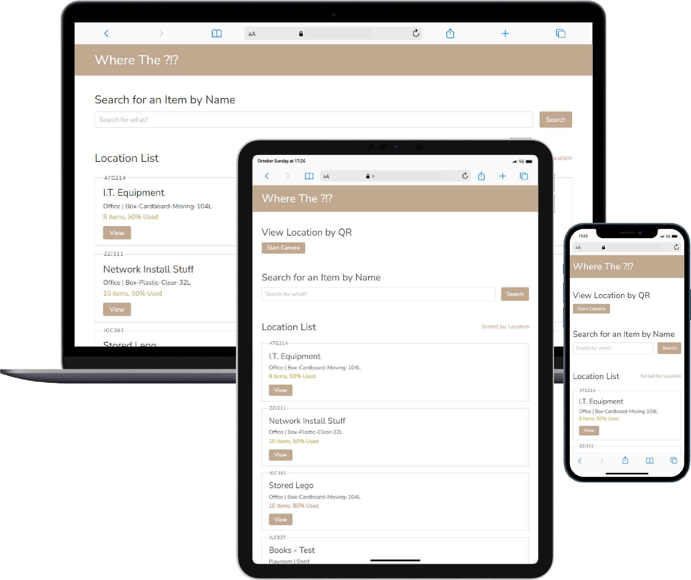

<div align="center">


# Where The ?!?

A simple Python Flask web application which helps keep track of your stored items.

<a href="https://danricho.com"></a> <a href="https://en.wikipedia.org/wiki/2022"></a> <a href="https://choosealicense.com/licenses/gpl-3.0/"></a>
<a href="https://www.python.org/"></a> <a href="https://flask.palletsprojects.com/"></a> <a href="https://flask-login.readthedocs.io/en/latest/"></a> <a href="https://marcoagner.github.io/Flask-QRcode/"></a> <a href="https://github.com/mebjas/html5-qrcode"></a> <a href="https://jquery.com/"></a> <a href="https://jenil.github.io/chota/"></a>

</div>

## Features

- Responsive web-based user interface
- Easy, simple location editing
- Search by stored item
- Sort locations by different attributes:
   - description
   - location (eg. Office, Garage, etc)
   - type (eg. Shelf, Plastic Box, etc)
   - recently edited
   - unique ID
   - how used (% full)
- QR codes to assist location tracking based on unique ID
- Print QR code labels from website
- Simple JSON storage (pros & cons)


## Screenshots

### Home Page



*Note that QR scanning is available on mobile phones / tablets only - due to my design decision for simplicity.*

### Viewing a Location


**More coming soon - does anyone know a quick way to generate this type of demo image?**

## Installation - Native Python

*These steps describe how I set it up. I use a linux terminal so under Windows there may be minor step inaccuracies.*

1.  Clone repo to a local directory.
    eg: `git clone https://github.com/danricho/where_the.git where_the`

1.  Create a Python Virtual Environment (venv).
    eg: `python3 -m venv venv`

1.  Install dependencies via pip into your venv.
    eg: `venv/bin/pip install -r requirements.txt` or activate venv then `pip install -r requirements.txt` 

1.  Create a `config.yml` and update according it to your setup - see the [Configuration section](#configuration-configyml).

1.  Install `main.py` in your venv.
    eg: `venv/bin/python main.py` or activate venv then `python main.py` 

## Installation - Docker Compose

*Running in Docker is a quick way to get this to run as a service (launches on boot etc).*

**Coming soon**

## Configuration (config.yml)

```yaml
FLASK: # These are Flask configuration settings
  HOST: 0.0.0.0
  PORT: '5000'
  SECRET: abcd1234 
  DEBUG: false
  TEMPLATES_AUTO_RELOAD: true
  USE_RELOADER: false
  LOGIN_DISABLED: false # this one disables authentication (login access control)

SITE:
  BASE_URL: http://localhost # this is your domain or start of your url 
  PATH_PREFIX: / # this is useful if you want a prefix on the url path

USERS: # users for flask-login - will be updated with settings... eg: if you change your sorting
  1:
    username: user
    password: pass
  2:
    username: user2
    password: pass
```

## What's Next / Future Improvements

I plan to start using it more to identify the holes I haven't found yet!  
I do have a few ideas that I'd like to add while maintaining the current simplicity as much as possible.  

Please propose and discuss ideas [here](https://github.com/danricho/where_the/discussions)!

My ideas so far (most would be choosen via a `config.yml` option):​
- Add `Dark Mode` to Chota CSS, which is very easy (as per the Chota webpage) and a toggle for it in the fixed header
- Remove oldest daily backups until less then X number are there... rolling buffer type thing... again easy.
- Add additional storage options other than raw JSON file  - [discussion](https://github.com/danricho/where_the/discussions/3)
- Improve `Flask-Login` implementation - [discussion](https://github.com/danricho/where_the/discussions/5)
- UI improvements - [discussion](https://github.com/danricho/where_the/discussions/9)
- Code improvements - [discussion](https://github.com/danricho/where_the/discussions/7)

I welcome contributions to these with Pull requests!