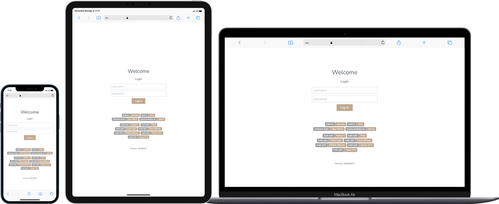
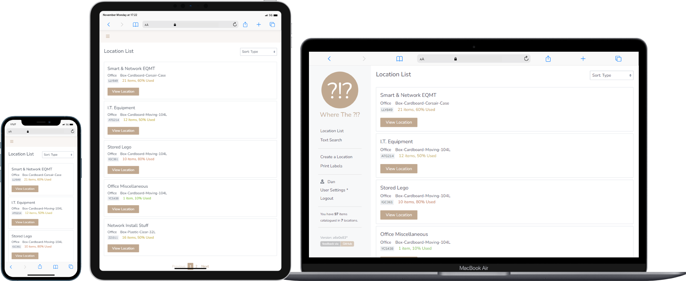
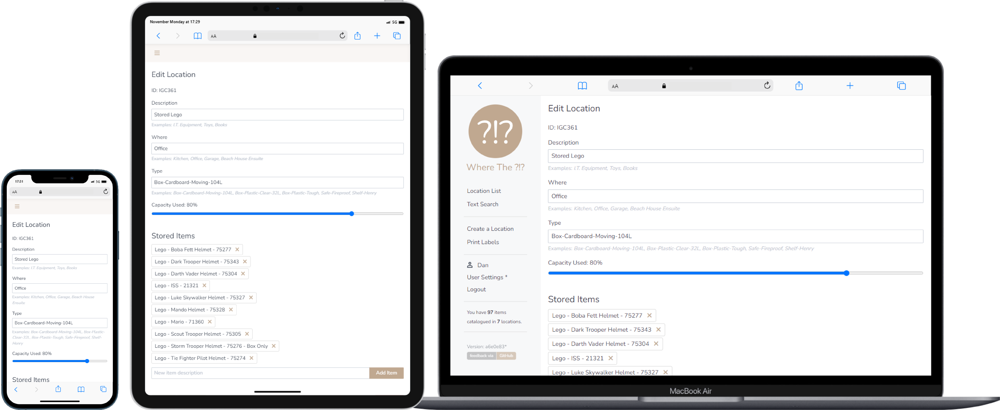
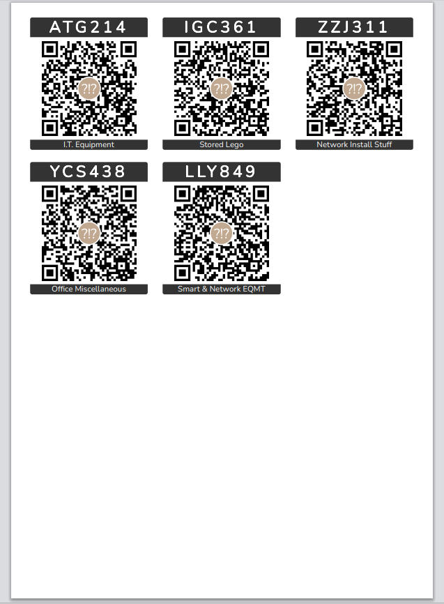

## Screenshots - Out of date already!

***Question for readers:** Does anyone know a quick way to generate this type of demo image?*

### Login Page

*Login page is only used when using Flask-Login for authentication.*

### Locations List

### Text Search for a Location/Item

### View Location

### Edit Location

### Menu Panel 

This is hidden in an off-canvas panel on smaller devices and selected by 'burger' icon.

*Option not shown here: QR Code scanning (screenshots rendered on a PC).*

### QR Code Label Printing (preview on Chrome)

Configurable label size and look and menu allows the user to choose number of each label and an offset to skip a number of 'already used' labels.

